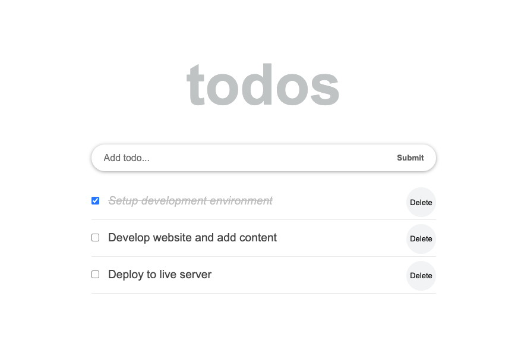

# React ToDo App

> Hello there, in this project I have tried to follow [React Tutorial From Scratch: A Step-by-Step Guide (2021)](https://ibaslogic.com/react-tutorial-for-beginners/) and build a todo app that allows you to add a new task and delete existing ones, and also mark as completed.

## Built With

- HTML5, CSS3, ES6
- React JS
- VS Code

## Live Demo (if available)

[Live Demo Link](https://livedemo.com)

## Author

👤 **Ibrohim Rasulov**

- GitHub: [@IbrohimRasulov](https://github.com/IbrohimRasulov)
- Twitter: [@IbrohimRasu1ov](https://twitter.com/IbrohimRasu1ov)
- LinkedIn: [LinkedIn](https://www.linkedin.com/in/ibrohim-rasulov-a88352209/)

## 🤝 Contributing

Contributions, issues, and feature requests are welcome!

Feel free to check the issues page.

## Show your support

Give a ⭐️ if you like this project!
